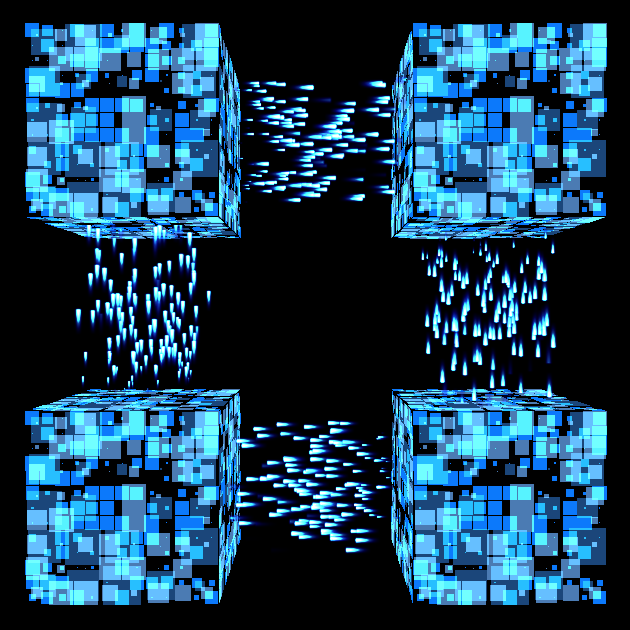

# Simple Unity FX Demo



This is a small project I made to start learning how to create nice looking effects on Unity. My main objective was to start working with shaders, and also took it as an opportunity to look into Unity's Cinemachine and Visual Effects Graph packages.

The rest of this document is an explanation on how to create the effects for this project, and the final result can be seen on this video:

[](https://youtu.be/P2RCdrVTKKs)

The project contains three different and separated parts, that are combined for the general effect. These are:

1. how to move the camera,
2. how to &#39;send&#39; particles between cubes,
3. and how to &#39;paint&#39; the surface of the cube.

We are going to go through each of them, in that same order, which gives us a nice progression to see our changes. But these are independent and can be implemented in any order.

### Requirements

I created this project using 2019.3.15f1, Cinemachine 2.6.0 and Visual Effect Graph 7.4. Earlier version of Unity (from 2018.3) and of the Packages should work too, but haven&#39;t been tested.

## Part 1: Camera Movement
----

### Setup

For the Camera movement, we are going to use a package called &#39;Cinemachine&#39;.

To install it, on Unity go to Windows → Package Manager.


There, search for Cinemachine and click on the &#39;Install&#39; button.


Once installed, you should be able to see a &#39;Cinemachine &#39; option on the upper menu.


### Adding required elements to the project

Cinemachine is not a replacement of the Camera component in Unity, but rather an enhancement. So, we still have our Camera component but instead of interacting with it directly, we do it through Cinemachine.

First thing to do, go to your Main Camera and add a &#39;CinemachineBrain&#39; component. As you might have guessed from the &#39;brain&#39; suffix, this component oversees the general settings/controls for the camera. We are going to leave the default settings untouched.

And since we&#39;re already modifying the camera, you can also set the background to a solid color since we don&#39;t want the skybox. (&#39;Camera&#39; → &#39;Clear Flags&#39; → &#39;Solid Color&#39;.) The project uses pitch-black, but you can choose whichever you like.


### Moving the camera

We are going to move the camera by interpolating between positions. Or rather, by setting the interpolation points, and letting Cinemachine do the actual interpolation for us.

We have two movements on the project. First, we rotate from the side to the front, and then we zoom in. We can achieve these movements having three interpolation points: one looking from the side (our starting point), one looking from the front (middle point), and another from the front but closer (final point).

We&#39;ll create three &#39;virtual cameras&#39; for these three points. In the menu, go to &#39;Cinemachine&#39; → &#39;Create Virtual Camera&#39;. This adds one virtual camera to the scene, so we repeat it twice more to have all the cameras we need.


Additionally, create and empty object in the scene. This empty (invisible) object will be helpful to set the initial position of the cameras. And it is required later to be able to shake the camera. I&#39;ll name this &#39;Center&#39;.


Leave the new GameObject at its current position (the center), and move the cameras to the following positions: (-10, 0, 0), (0, 0, -10), (0, 0, -4) for side, front-far and front-close cameras, respectively.

All cameras should be looking front right now, which is not correct for our side camera. We can fix this in two ways. One is by setting the rotation ourselves, and the other one is having the camera adjust itself to look at the center. Let&#39;s try the later one.

On the first virtual camera, drag our target GameObject (&#39;Center&#39;) to the &#39;CinemachineVirtualCamera&#39; → &#39;LookAt&#39; property. Once you do that, the rotation should have automatically been changed to (0, 90, 0), setting the camera to look at the center.


&#39;Look At&#39; means that no matter if the camera or the object moves, the rotation should be adjusted to still be looking directly at that object. We also have &#39;Follow&#39;, which means that the camera should move to keep looking at the object we want to follow.

You&#39;ll notice a warning on the body section. This is because we don&#39;t have anything set on &#39;Follow&#39;, which we&#39;re not going to use. To get rid of the error, just set this section to &#39;&#39;Do nothing&quot;.


Now that we have the virtual cameras set, how do we render them on our Main Camera? It&#39;s actually easy: since the camera already has &#39;CinemachineBrain&#39; attached, the virtual camera with the highest priority will be renderer. So, to change between cameras, we just change their priorities. And when the cameras are changed, the interpolation is handled for us through the &#39;Default Blend&#39; parameter (&#39;Ease In Out&#39; at 2 seconds should be already set; we&#39;ll leave it like that).

A simple code to change the priority could look something like the one below. Basically, we&#39;re just changing the priorities&#39; values and waiting for the interpolations to occur.

```csharp
using System.Collections;
using Cinemachine;
using UnityEngine;

public class CameraSequence : MonoBehaviour
{
    [SerializeField] private CinemachineVirtualCamera _sideVirtualCamera = null;
    [SerializeField] private CinemachineVirtualCamera _farVirtualCamera = null;
    [SerializeField] private CinemachineVirtualCamera _closeVirtualCamera = null;

    void Start()
    {
        StartCoroutine(MyCoroutine());
    }

    IEnumerator MyCoroutine()
    {
        _sideVirtualCamera.Priority = 10;
        _farVirtualCamera.Priority = 1;
        _closeVirtualCamera.Priority = 1;

        yield return new WaitForSeconds(0.5f);

        _sideVirtualCamera.Priority = 1;
        _farVirtualCamera.Priority = 10;
        _closeVirtualCamera.Priority = 1;

        yield return new WaitForSeconds(2f);

        _sideVirtualCamera.Priority = 1;
        _farVirtualCamera.Priority = 1;
        _closeVirtualCamera.Priority = 10;

        yield return new WaitForSeconds(2f);
    }
}
```

Attach this code to an object in the scene, set up the virtual cameras references, hit play and… you&#39;ll se nothing. Because there is nothing to see in the scene, even if the camera is actually moving. To fix that, add four cubes and set them at (-1, -1, 0), (-1, 1, 0), (1, 1, 0) and (1, -1, 0).

### Shaking the camera

Having the virtual cameras set up, we&#39;ll add just a few things to get the shaking effect.

On our final virtual camera (front-close), we set the &#39;Noise&#39; property to &#39;Basic Multi Channel Perlin&#39;, and the &#39;Noise Profile&#39; to &#39;6D Shake&#39;. By adding this, we&#39;re telling the camera &quot;move randomly (based on Perlin noise)&quot;, which is the equivalent to saying, &quot;start shaking&quot;. The &#39;Amplitude&#39; and &#39;Frequency&#39; values are important: amplitude is how much it is going to shake and frequency, how often.

We don&#39;t want the camera to shake all the time. So, we&#39;ll add a script to start the shaking when we click on the cubes and other script to control the shaking.

The click one is easy. Create a script, with a `private void OnMouseDown()` method, and attach it to all four cubes. From there we&#39;ll start the shaking.

For the actual shaking script, we&#39;re going to control the amplitude from the code, so be sure to set that to 0 beforehand on the component. You can set the frequency at any value you like; we&#39;ll leave it at 1 for this example.

A simple code would look as the one below. For easy access, we&#39;re going to control this as a singleton (hence the static `Instance` field). We have three methods, only one of those is public, which is the one we&#39;re going to call to start the shaking effect (`ShakeCamera`). The other two (`Awake` and `Update`) are inherited from `MonoBehaviour`, and you&#39;re probably already familiar with them.

In `Awake` we add the basic initialization of the fields we&#39;re going to use and are not initialized on declaration.

`ShakeCamera` takes two parameters: how intense we want it to shake (`intensity`) and for how long (`time`). Basically, we just store those values, and set the intensity to camera (as we mentioned, this is the amplitude of the noise).

On Update we count until the time has passed, and then turn of the effect. We can turn it off gradually (as in the code below), by using `Lerp` to interpolate between the initial value and zero. Or we could also leave the value unchanged until the last moment, then set it zero, to get a more abrupt effect.

```csharp
using Cinemachine;
using UnityEngine;

[RequireComponent(typeof(CinemachineVirtualCamera))]
public class CameraController : MonoBehaviour
{
    public static CameraController Instance { get; private set; }

    private float _totalTime = 0f;
    private float _remaingTime = 0f;
    private float _initialIntensity = 0;
    private CinemachineVirtualCamera _virtualCamera = null;

    private void Awake()
    {
        Instance = this;
        _virtualCamera = GetComponent<CinemachineVirtualCamera>();
    }

    public void ShakeCamera(float intensity, float time)
    {
        var multiChannelPerlin =
            _virtualCamera.GetCinemachineComponent<CinemachineBasicMultiChannelPerlin>();

        _initialIntensity = intensity;
        multiChannelPerlin.m_AmplitudeGain = intensity;

        _remaingTime = time;
        _totalTime = time;
    }

    private void Update()
    {
        _remaingTime -= Time.deltaTime;
        if (_remaingTime > 0f)
        {
            var multiChannelPerlin =
            _virtualCamera.GetCinemachineComponent<CinemachineBasicMultiChannelPerlin>();
            multiChannelPerlin.m_AmplitudeGain = 
                Mathf.Lerp(0, _initialIntensity, _remaingTime / _totalTime);
        }
    }
}
```

## Part 2: Particles
----

### Setup

As with the camera, the first thing we&#39;ll do is to add a new Package to the project. In this case, it will be the &#39;Visual Effect Graph&#39; package.


### VFX Graph

Visual Effect Graph is a really nice package that lets you do, well, basically what the name implies: create visual effects through a graph.

It is also very efficient. Since it is running on the GPU, instead of the CPU, you can have thousands of particles with minimal hit on performance. The downside is that since it is running on the GPU, it is much harder to interact with other objects you might have on the scene.

For a new graph, go to Create → Visual Effects → Visual Effect Graph. Drag the new file into the scene, so we can see the particles as we change them.


Select the newly created effect and look at its graph (Window → Visual Effects → Visual Effect Graph). If you don&#39;t see anything in the window, try moving around a bit (Alt + dragging moves the graph; the mouse wheel zooms in and out). You should find a graph like the one below: 


In the graph, the top-to-bottom blocks are the one that define the behavior of the particles in the effect. We can add, remove or modify block to get different effects. Also, you might have noticed the variables in the boxes have a small circle to their left. This is used to &#39;plug in&#39; values to these variables, instead of having them fixed. Through this, we can add node that control the value of the variable, or even send values from scripts into the graph. But for the moment, we&#39;ll just use the basic default structure.

***Spawn*** : When and how the particles are going to be added into the scene. We want a constant flow of particles, so we&#39;ll leave the &#39;Constant Spawn Rate&#39; with a value of 160.

***Initialize Particle*** : When a particle is created, which values are going to be set. We&#39;re going to set the capacity (maximum number of particles) to 200. To make it seem as if the particles are going from one cube to another, we&#39;re going to set the velocity to be in only one axis (random values from (0, 0.6, 0) to (0, 1.2, 0)), and a lifetime between 0.5 and 1.5. This will make the particles disappear about the time when they&#39;re reaching the next cube.

Right now, all the particles are being created from the same point, which doesn&#39;t look that nice. We&#39;re going to change that. Click on &#39;Initialize Particle&#39; and then press spacebar. This will bring a list of blocks that we can add to the graph. Select Position → Position (AABox). This will create a box from where the particles are going to be spawned. We&#39;ll change the center to (0, 0.5, 0) and set the size to (0.65, 0, 0.65). Move the position of the VFX object to the position of a cube, and it will appear as if the particles are radiating from the surface of that cube.

***Update Particle*** : Changes what happen through the life of the particle. We&#39;ll leave this blank.

***Output Particle Quad*** : Changes the appearance of the particle through its life. Start by changing the Color Mapping to &#39;Gradient Mapped&#39;, to set the color of the particle to a gradient. The default are red/yellowish hues, that makes it look like fire; I chose to change it to blue tones.

Next step is to change the Main Texture. We&#39;ll chose &#39;Sparkle&#39;, which is already included, so we don&#39;t have to create the texture. Once set, it will look somewhat too big. To change it, add a &#39;Set Scale&#39; block (press spacebar, then go Attribute → Set → Set Scale). Change it to XY channels, and set it to (0.12, 0.35). You can also play with the size curve on &#39;Set Size over Life&#39;.

Having everything sety, the graph should look something like this:


And the effect, something like this:


Once you&#39;re satisfied with the look of the effect, you can copy and move/rotate it to match the other cubes.

## Part 3: Shader for the cube
----

### Pre-requirements

This section is a somewhat different to the other two. To begin with, unlike the previous, we don&#39;t need to add packages to the project for this effect.

Also, instead of explaining all the details, this section overviews previous shaders and explains how to combine them into the one use in this project. So, some previous shader experience is helpful.

The original shaders and more in detail explanation on how they work can be found here (all in Japanese, though):

[https://3dnchu.com/archives/unity-shader-drawing-introduction/](https://3dnchu.com/archives/unity-shader-drawing-introduction/)

### Growing squares
```hlsl
   float rand(float2 st)
   {
      return frac(sin(dot(st, float2(12.9898, 78.233))) * 43758.5453);
   }

   float box(float2 st, float size)
   {
      size = 0.5 + size * 0.5;
      st = step(st, size) * step(1.0 - st, size);
      return st.x * st.y;
   }

   float box_size(float2 st, float n)
   {
      st = (floor(st * n) + 0.5) / n;
      float offs = rand(st) * 5;
      return (1 + sin(_Time.y * 3 + offs)) * 0.5;
   }

   float box_effect(float2 uv, float n)
   {
      float2 st = frac(uv * n);
      float size = box_size(uv, n);
      return box(st, size);
   }
```

Overview of the functions:

**`rand`**: Creates a pseudo-random number. A good explanation of how it works and how those specific constants were obtained can be seen here: [https://thebookofshaders.com/10/](https://thebookofshaders.com/10/)

**`box`**: Returns 1 if the point `st` is inside a box of size `size`; 0 otherwise. Both the coordinates of the point and the size of the box are expected to be values between 0 and 1. The first line offsets the calculations to the center. The second line checks if the _x_ coordinate is within `size` to the left and to the right; and checks if _y_ it&#39;s within top and button. Finally, it returns if both _x_ and _y_ are inside.

**`box_size`**: This function cuts the board in `n` pieces horizontally and `n` pieces vertically. Then, use the time and the sine function to continuously chance the size of this boxes. So, given a coordinate `st`, it tells us the size of the box it falls into. Without the line in the middle (the offset), this would not be that helpful, considering all the boxes would be the same size. By adding the random offset, now each box is a different size.


**`box_effect`**: Combines the previous two effects. It uses `box_size` to determine the size of the box at the current coordinate, and uses `box` to know if that coordinates falls within that box or not.

So far, same as in the tutorial mentioned above. Now to add some color:
```hlsl
   float4 colored_boxes(float2 uv)
   {
      float a = box_effect(uv, 5);
      float b = box_effect(uv, 8);
      float c = box_effect(uv, 13);

      float4 color1 = float4(0.106, 0.275, 0.478, 1);
      float4 color2 = float4(0.294, 0.482, 0.706, 1);
      float4 color3 = float4(0.047, 0.475, 0.988, 1);

      return (a * color1) + (b * color2) + (c * color3);
   }
```


We are setting three different sizes and three different colors. For the sizes of the boxes, I chose consecutive Fibonacci numbers, so there wouldn&#39;t be much overlap. And for the colors, shades of blue. The function `box_effect` gives us either 1 or 0. So, if we multiply the color by that result, we either keep the color or get black. Finally, we add all the colors together. These values could be normalized so they stay in the 0 to 1 range, but it&#39;s not necessary.

### Distortion

The distortion effect is also taken from the above tutorial:
```hlsl
   float circle(float2 st, float2 radius)
   {
      return step(distance(0.5, st), radius);
   }

   float4 distort(float2 uv)
   {
      float t = 2 * uv.y + sin(_Time.y * 5);
      float distort = sin(_Time.y * 5) * 0.1
                      * sin(5 * t) * (1 - (t - 1) * (t - 1));

      uv.x += distort; 
      return float4(circle(uv - float2(0, distort) * 0.3, 0.42),
                    circle(uv + float2(0, distort) * 0.3, 0.38),
                    circle(uv + float2(distort, 0) * 0.3, 0.40),
                    1);
   }
```

**`circle`**: Similar to `box`, but instead of for a square, in this function we test if a point with coordinates `st` falls within a circle of radius `radius`. As the previous, coordinates of the point and the radius are expected to be values between 0 and 1.

**`distort`**: Adds a little offset in the horizontal position (_x_), based on the vertical position (_y_), by using the sine function and the current time. By choosing different values for the offset in each of the rgb color channels, we get an interesting wavy effect.


### Using and combining them

We are going to call the previous functions from the fragment shader, like this:
```hlsl
   float4 frag(v2f_img i) : SV_Target
   {
       float4 colorBox = colored_boxes(i.uv);
       float4 distortion = (_IsShaking == 0)
          ? float4(1, 1, 1, 1)
          : distort(i.uv) * 0.9 + 0.1;
       return colorBox * distortion;
   }
```

This time, we&#39;re combining colors by multiplying them, instead of adding. Let&#39;s see why. For a color, 0 is darkest and 1 brightest. When we&#39;re adding the colors in `colored_boxes`, the intersections become brighter, while the parts without boxes remain black. In the distortion we have a lot of white already, and it would look nicer to have a hole instead, so we multiply. Places that used to be white on the distortion will preserve the `colorBox` colors; place that are black in the distortion will remain mostly black (not completely, since we&#39;re taking only 90%); and place in between will become darkened. We do this only when the scene is shaking; otherwise, we don&#39;t use the distortion.


The whole code can be found at `Assets/Shaders/CellShader.shader`. Create a new material, set the shader of the new material to this code, and you&#39;re ready to use it on the cubes.

To have the distortion effect activate, we can do it like in the code below. And to turn it off, we just set the value to zero again.

```csharp
    var renderer = GetComponent<Renderer>();
    renderer.material.SetFloat("_IsShaking", 1);
```

## References

_Cinemachine_

[https://docs.unity3d.com/Packages/com.unity.cinemachine@2.6/manual/index.html](https://docs.unity3d.com/Packages/com.unity.cinemachine@2.6/manual/index.html)

_How to do Camera Shake with Cinemachine!_

[https://youtu.be/ACf1I27I6Tk](https://youtu.be/ACf1I27I6Tk)

_Visual Effect Graph_

[https://docs.unity3d.com/Packages/com.unity.visualeffectgraph@7.3/manual/index.html](https://docs.unity3d.com/Packages/com.unity.visualeffectgraph@7.3/manual/index.html)

_楽しい！Unityシェーダー お絵描き入門！_

[https://3dnchu.com/archives/unity-shader-drawing-introduction/](https://3dnchu.com/archives/unity-shader-drawing-introduction/)

_The Book of Shaders, Generative designs (Random)_

[https://thebookofshaders.com/10/](https://thebookofshaders.com/10/)